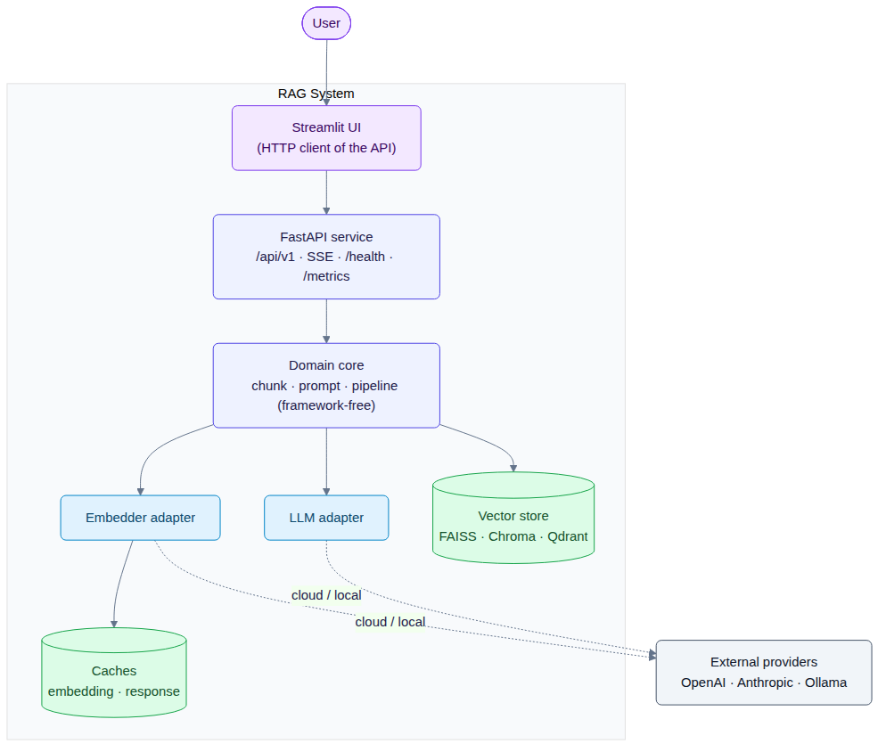
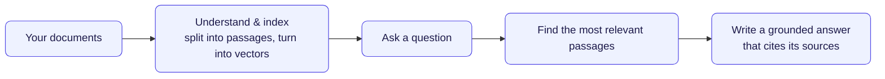
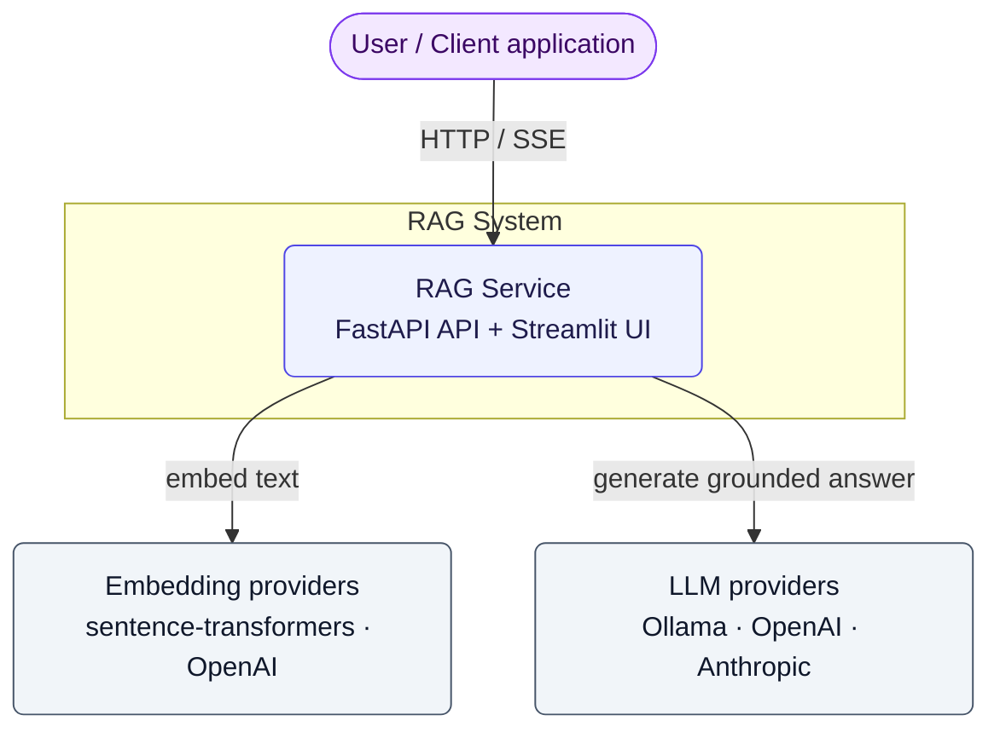
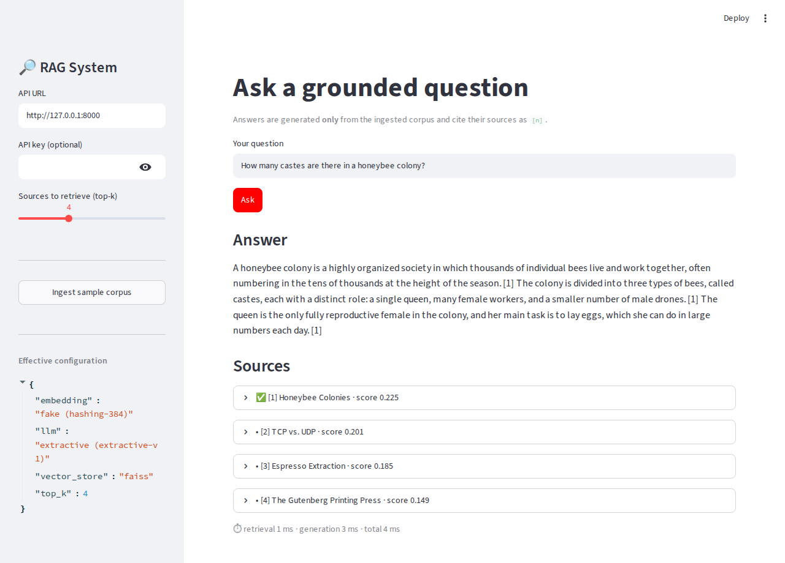
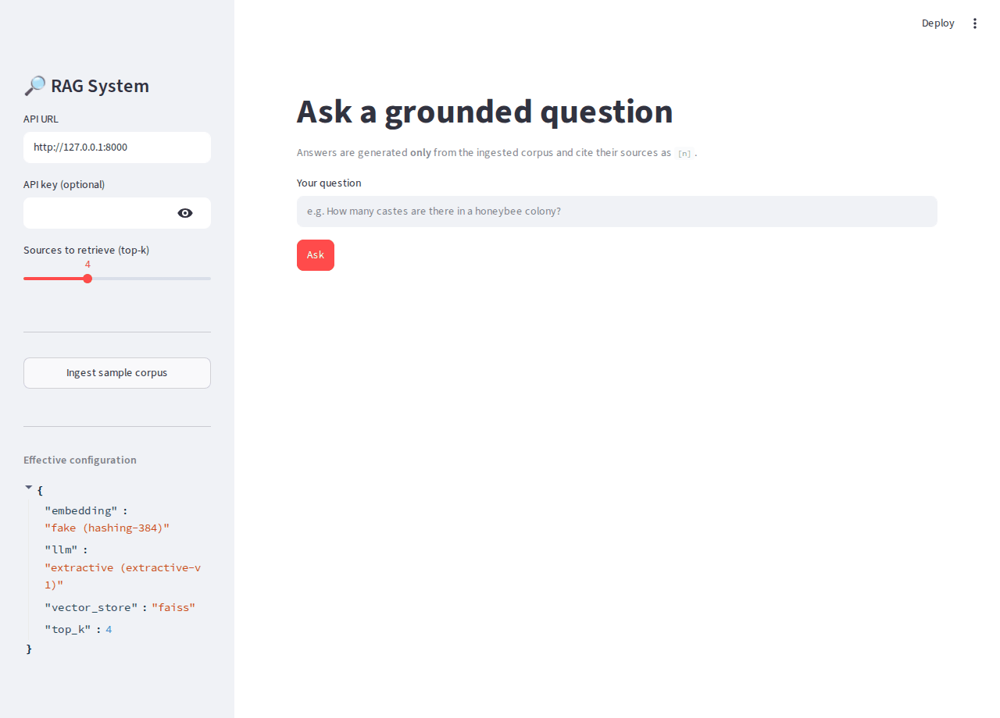
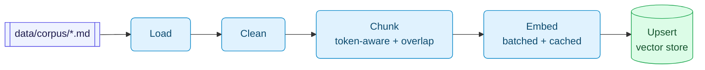
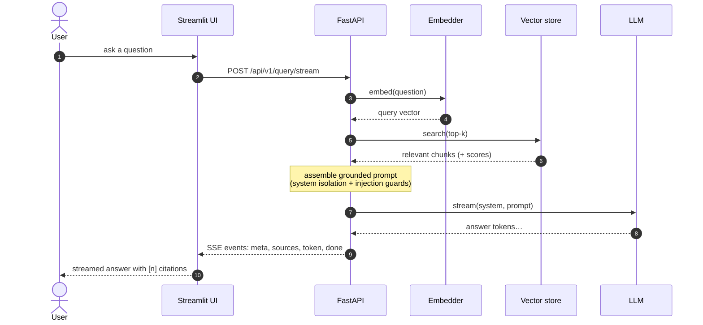
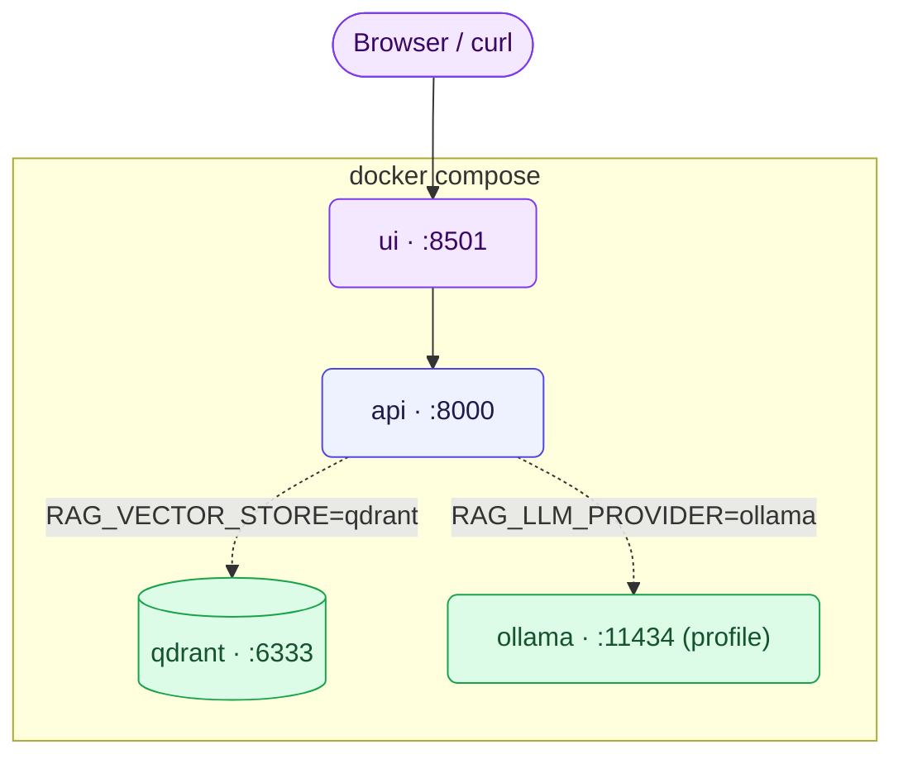

# RAG System

> A provider-agnostic Retrieval-Augmented Generation service: ingest documents, retrieve the relevant passages, and stream an answer that cites its sources. Hexagonal architecture, local or cloud providers switchable by config, and an offline default so it runs end to end on a fresh clone without any API keys.

[](https://github.com/jjsanda/rag_system/actions/workflows/ci.yml) [](https://github.com/jjsanda/rag_system/actions/workflows/codeql.yml)   [](LICENSE)

<p align="center">
   
</p>

---

## Table of contents

- [RAG System](#rag-system)
  - [Table of contents](#table-of-contents)
  - [What is this? (and why RAG)](#what-is-this-and-why-rag)
  - [Features](#features)
  - [Architecture \& design decisions](#architecture--design-decisions)
  - [Quickstart](#quickstart)
    - [1. One command with Docker (recommended)](#1-one-command-with-docker-recommended)
    - [2. Local dev with uv](#2-local-dev-with-uv)
    - [3. Kubernetes with Helm](#3-kubernetes-with-helm)
  - [Configuration](#configuration)
  - [Usage](#usage)
    - [The UI](#the-ui)
  - [How RAG works here](#how-rag-works-here)
  - [Evaluation \& metrics](#evaluation--metrics)
  - [Project structure](#project-structure)
  - [Testing](#testing)
  - [Tech stack \& why](#tech-stack--why)
  - [Deployment](#deployment)
  - [Roadmap](#roadmap)
  - [License](#license)
  - [Acknowledgments](#acknowledgments)
  - [Assumptions \& version notes](#assumptions--version-notes)

---

## What is this? (and why RAG)

A language model doesn't know your private documents, and when asked about them it tends to guess. Retrieval-Augmented Generation addresses this by retrieving the most relevant passages from your own content and asking the model to answer only from those, with citations you can check.



This project implements that whole pipeline as a runnable service, including the operational parts: configuration, observability, packaging, and deployment.

## Features

- **Grounded, cited answers** streamed token by token over Server-Sent Events.
- **Hexagonal architecture.** A framework-free core behind ports; providers and stores are swappable adapters.
- **Hybrid providers, config-only switching** (no code changes):
  - Embeddings: deterministic offline `fake` · `local` (sentence-transformers) · `openai`
  - LLM: `extractive` (offline) · `ollama` · `openai` · `anthropic`
  - Vector store: `faiss` (default, no separate service) · `chroma` · `qdrant`
- **Runs offline by default.** A hashing embedder, an extractive answerer, and FAISS mean the whole thing works with no API keys and no external services.
- **Two interfaces:** an async FastAPI service (`/api/v1`, OpenAPI docs, SSE) and a Streamlit UI that talks to it over HTTP.
- **Production concerns built in:** structured JSON logs with request IDs, Prometheus `/metrics` (retrieval vs. generation timed separately), `/health` + `/ready` probes, timeouts + retries with backoff, graceful degradation, rate limiting, prompt-injection mitigation, input limits.
- **Performance:** read-through embedding cache, optional response cache, batched embedding, fully async I/O.
- **Packaged and operable:** multi-stage non-root Docker image, docker-compose, a Helm chart, a Makefile, and a GitHub Actions CI pipeline (lint, type-check, test with coverage, build, then a security scan) plus CodeQL.
- **Evaluated:** a labeled QA set scored for hit@k, MRR, key-fact coverage, and groundedness (`make eval`).

## Architecture & design decisions

The core RAG logic (`rag.domain`) imports no framework and no provider SDK. Everything external is a `typing.Protocol` **port**; concrete **adapters** implement those ports, and a single composition root (`rag.factory`) wires them from configuration.

**System context (C4 L1):**



The container diagram is shown at the top. Key decisions are recorded as short ADRs in [`docs/adr/`](docs/adr/):

1. [Hexagonal architecture](docs/adr/0001-hexagonal-architecture.md)
2. [Cloud adapters over httpx (not SDKs)](docs/adr/0002-provider-adapters-over-httpx.md)
3. [Offline-deterministic default stack](docs/adr/0003-offline-deterministic-default.md)
4. [FAISS default store, Qdrant for production](docs/adr/0004-vector-store-faiss-default.md)
5. [SSE streaming & pure-ASGI middleware](docs/adr/0005-sse-streaming-and-middleware.md)
6. [Observability](docs/adr/0006-observability.md)

## Quickstart

### 1. One command with Docker (recommended)

```bash
docker compose up --build
```

Then:

- API docs: <http://localhost:8000/docs>
- UI: <http://localhost:8501>
- Ingest the bundled corpus and ask a question (see [Usage](#usage)).

This runs the **offline** stack (no keys needed). The compose file also starts Qdrant; an Ollama service is available behind `--profile ollama`.

### 2. Local dev with uv

```bash
make setup                  # uv sync (+ extras) and pre-commit hooks
make run                    # API at http://localhost:8000  (uvicorn --reload)
make ui                     # Streamlit UI at http://localhost:8501 (separate terminal)
```

`make` with no target lists everything (`fmt`, `lint`, `type`, `test`, `test-cov`, `e2e`, `eval`, `diagrams`, `up`, `down`, …).

### 3. Kubernetes with Helm

```bash
helm install rag deploy/helm/rag-system
# enable autoscaling + an in-cluster Qdrant:
helm install rag deploy/helm/rag-system \
  --set api.autoscaling.enabled=true --set qdrant.enabled=true
helm test rag
```

## Configuration

12-factor configuration via environment variables (or a `.env`; copy [`.env.example`](.env.example)). Every value has a safe default, so an empty environment runs the offline stack. API keys are read from the conventional un-prefixed names.

| Variable | Default | Description |
| --- | --- | --- |
| `RAG_ENV` | `local` | `local` or `prod` (prod hides the `/docs` and `/redoc` UIs). |
| `RAG_LOG_LEVEL` / `RAG_LOG_JSON` | `INFO` / `true` | Log level; JSON vs. pretty console logs. |
| `RAG_HOST` / `RAG_PORT` | `0.0.0.0` / `8000` | API bind address. |
| `RAG_CORS_ORIGINS` | `*` | Comma-separated allowed origins. |
| `RAG_API_KEY` | _(unset)_ | If set, requests must send `X-API-Key`. |
| `RAG_MAX_QUESTION_CHARS` | `4000` | Reject longer questions. |
| `RAG_MAX_DOCUMENT_CHARS` | `200000` | Reject larger documents on ingest. |
| `RAG_REQUEST_TIMEOUT_S` | `30` | Provider call timeout (seconds). |
| `RAG_RATE_LIMIT` | `60/minute` | Per-IP limit on `/api/v1` (empty disables). |
| **`RAG_EMBEDDING_PROVIDER`** | `fake` | `fake` · `local` · `openai`. |
| **`RAG_LLM_PROVIDER`** | `extractive` | `extractive` · `ollama` · `openai` · `anthropic`. |
| **`RAG_VECTOR_STORE`** | `faiss` | `faiss` · `chroma` · `qdrant`. |
| `RAG_TOKENIZER_ENCODING` | `cl100k_base` | tiktoken encoding for chunking. |
| `RAG_CHUNK_SIZE` / `RAG_CHUNK_OVERLAP` | `400` / `80` | Token-aware chunk size and overlap. |
| `RAG_TOP_K` | `4` | Passages retrieved per query. |
| `RAG_EMBEDDING_DIM` | `384` | Vector dim for the `fake` embedder / store init. |
| `RAG_LOCAL_EMBEDDING_MODEL` | `sentence-transformers/all-MiniLM-L6-v2` | Local model. |
| `RAG_OPENAI_EMBEDDING_MODEL` | `text-embedding-3-small` | OpenAI embedding model. |
| `OPENAI_API_KEY` / `OPENAI_BASE_URL` | _(unset)_ | OpenAI credentials / base URL override. |
| `RAG_LLM_TEMPERATURE` / `RAG_LLM_MAX_TOKENS` | `0.1` / `512` | Generation knobs. |
| `RAG_SYSTEM_PROMPT` | _(default)_ | Override the grounded system prompt. |
| `RAG_OPENAI_LLM_MODEL` | `gpt-4o-mini` | OpenAI chat model. |
| `RAG_ANTHROPIC_LLM_MODEL` | `claude-haiku-4-5` | Anthropic model. |
| `ANTHROPIC_API_KEY` | _(unset)_ | Anthropic credentials. |
| `RAG_OLLAMA_BASE_URL` / `RAG_OLLAMA_LLM_MODEL` | `http://localhost:11434` / `llama3.2` | Ollama. |
| `RAG_COLLECTION_NAME` | `rag_documents` | Vector store collection name. |
| `RAG_FAISS_PATH` / `RAG_CHROMA_PATH` | `./.data/...` | On-disk persistence paths. |
| `RAG_QDRANT_URL` / `RAG_QDRANT_API_KEY` | `http://localhost:6333` / _(unset)_ | Qdrant. |
| `RAG_EMBEDDING_CACHE` | `memory` | `none` · `memory` · `disk`. |
| `RAG_EMBEDDING_CACHE_PATH` / `RAG_EMBEDDING_CACHE_SIZE` | `./.data/embcache` / `10000` | Disk-cache path; in-memory LRU max entries. |
| `RAG_RESPONSE_CACHE` / `RAG_RESPONSE_CACHE_TTL_S` | `none` / `300` | Optional answer cache. |
| `RAG_PROVIDER_MAX_RETRIES` / `RAG_PROVIDER_BACKOFF_S` | `3` / `0.5` | Retry policy. |
| `RAG_FALLBACK_TO_OFFLINE` | `true` | Degrade to offline providers if a real one is down. |
| `RAG_METRICS_ENABLED` | `true` | Expose Prometheus `/metrics`. |
| `OTEL_ENABLED` / `OTEL_SERVICE_NAME` / `OTEL_EXPORTER_OTLP_ENDPOINT` | `false` / `rag-system` / `http://localhost:4318` | OpenTelemetry (needs the `otel` extra). |
| `RAG_CORPUS_DIR` | `./data/corpus` | Sample corpus directory. |
| `RAG_API_URL` | `http://localhost:8000` | API base URL the UI calls. |
| `RAG_UI_PORT` | `8501` | Streamlit UI port. |

Example: switch to a fully cloud stack without touching code:

```bash
RAG_EMBEDDING_PROVIDER=openai RAG_LLM_PROVIDER=anthropic RAG_VECTOR_STORE=qdrant \
OPENAI_API_KEY=sk-... ANTHROPIC_API_KEY=sk-ant-... docker compose up
```

## Usage

**Ingest** the bundled corpus, then **ask**:

```bash
curl -X POST localhost:8000/api/v1/ingest \
  -H 'content-type: application/json' -d '{"use_sample_corpus": true}'

curl -X POST localhost:8000/api/v1/query \
  -H 'content-type: application/json' \
  -d '{"question": "How many castes are there in a honeybee colony?", "top_k": 4}'
```

```jsonc
{
  "answer": "A honeybee colony has ... three types of bees, called castes ... [1] ...",
  "citations": [1],
  "sources": [{ "number": 1, "doc_id": "honeybee-colonies", "score": 0.22, "snippet": "..." }],
  "timings": { "retrieval_ms": 1.2, "generation_ms": 3.4, "total_ms": 4.6 },
  "model": "extractive-v1", "llm_provider": "extractive", "request_id": "…"
}
```

**Stream** the answer (SSE):

```bash
curl -N -X POST localhost:8000/api/v1/query/stream \
  -H 'content-type: application/json' -d '{"question": "What is photosynthesis?"}'
```

**Python client** (just `httpx`):

```python
import httpx

base = "http://localhost:8000"
httpx.post(f"{base}/api/v1/ingest", json={"use_sample_corpus": True})
r = httpx.post(f"{base}/api/v1/query", json={"question": "What force moves Roman aqueducts?"})
data = r.json()
print(data["answer"])
for s in data["sources"]:
    print(f"  [{s['number']}] {s['title']}  ({s['score']:.2f})")
```

**CLI** (installed as `rag`; honours the same configuration):

```bash
rag info                            # show the effective configuration
rag ingest --sample                 # ingest the bundled corpus
rag query "What is photosynthesis?" # grounded, cited answer in the terminal
```

### The UI

The Streamlit UI streams the answer, shows which sources were cited, and reports the retrieval-vs-generation latency split.

| Home | Ask & stream | Demo |
| --- | --- | --- |
|  |  |  |

## How RAG works here

**Ingestion** loads each document, cleans it, splits it into token-aware overlapping chunks, embeds the chunks in batches (with caching), and upserts them into the vector store:



**Query.** Embed the question, retrieve top-k, assemble a grounded prompt (with system-prompt isolation and injection guards), then stream a cited answer:



## Evaluation & metrics

`make eval` ingests the corpus on the offline stack, runs the [labeled QA set](evaluation/qa_dataset.json), and computes retrieval and answer-quality metrics (all math in pure Python; see [`evaluation/run_eval.py`](evaluation/run_eval.py)). Latest run:

| metric | value |
| --- | --- |
| questions | 12 |
| hit@5 | 1.00 |
| MRR | 0.785 |
| key-fact coverage | 1.00 |
| groundedness | 0.844 |

One caveat: the default embedder is lexical (a zero-dependency hashing embedder), so it has no real semantics. On a corpus this small it still puts the right document in the top 5 every time, but the ranking is rough: the gold document often isn't first, which is why MRR sits well below 1.0. Switching to `local`/`openai` embeddings sharpens it; re-run `make eval` to compare. See [`evaluation/`](evaluation/).

## Project structure

```text
src/rag/
├── domain/          # framework-free core: models, ports, chunking, prompt, pipeline
├── adapters/        # embeddings/ llm/ vectorstore/ loaders/ cache/  + tokenizer, fallback
├── config/          # pydantic-settings
├── observability/   # structured logging, Prometheus metrics, optional OTel
├── api/             # FastAPI app, routes (v1), schemas, deps, errors, middleware, ratelimit
├── cli.py           # command-line interface (info / ingest / query)
└── factory.py       # composition root (Settings -> wired Services)
ui/                  # Streamlit UI (HTTP client of the API)
tests/               # unit + integration + e2e (mocked providers, ≥80% coverage)
evaluation/          # labeled QA set + metrics harness
deploy/              # docker/ (multi-stage Dockerfile) + helm/ (chart)
docs/                # adr/ (decisions) + diagrams/ (Mermaid + exported SVG/PNG) + assets/
data/corpus/         # sample documents for the demo and evaluation
```

## Testing

```bash
make test         # full suite
make test-cov     # with coverage gate (≥80%)
make e2e          # end-to-end: ingest corpus -> grounded cited answer
```

- **Unit** tests cover the domain (chunker, prompt assembly + injection, pipeline) with tiny fakes and verify every docstring example.
- **Integration** tests drive the FastAPI app over ASGI and mock cloud providers with `respx` (no network); optional stores run in-process.
- **E2E** ingests the real corpus on the offline stack and asserts a grounded, cited answer.

## Tech stack & why

| Area | Choice | Why |
| --- | --- | --- |
| Language / tooling | Python 3.11+, **uv**, ruff, black, **mypy --strict** | Fast, reproducible, strictly typed. |
| API | **FastAPI** + `sse-starlette` | Async, OpenAPI, native SSE streaming. |
| Config | **pydantic-settings** v2 | 12-factor, validated, typed. |
| Chunking | **tiktoken** | Provider-independent token counting. |
| Vector store | FAISS (default) / Chroma / Qdrant | No separate service by default; production option behind one port. |
| Cloud providers | raw **httpx** + **tenacity** | Small deps, hermetic `respx` tests, explicit resilience. |
| Observability | **structlog** + **prometheus-client** (+ optional OTel) | JSON logs with request IDs; retrieval/generation timed apart. |
| UI | **Streamlit** | Fast to build a clear, streaming demo UI. |
| Packaging | multi-stage **Docker**, **Helm**, GitHub Actions | Small non-root image; k8s-ready; CI gates. |

Rationale for the bigger calls lives in [`docs/adr/`](docs/adr/).

## Deployment

**docker compose** (local):



**Kubernetes** via the Helm chart (`deploy/helm/rag-system`): api and ui Deployments and Services, a ConfigMap + optional Secret, non-root pods, liveness/readiness probes, optional HPA and Ingress, and an optional in-cluster Qdrant. See the [Kubernetes diagram](docs/diagrams/07-deployment-kubernetes.png) and `helm test`.

## Roadmap

- Reranking (cross-encoder) and hybrid (BM25 + dense) retrieval.
- LLM-as-judge faithfulness scoring in the evaluation harness (`--judge`).
- Streaming citations highlighted inline as tokens arrive.
- A shared/distributed rate limiter for multi-replica deployments.
- Incremental re-ingestion and corpus versioning for the response cache.

## License

[Apache 2.0](LICENSE).

## Acknowledgments

Built with FastAPI, Streamlit, FAISS, Qdrant, Chroma, sentence-transformers, tiktoken, structlog, Prometheus, Pydantic, httpx, tenacity, and uv. Diagrams rendered with mermaid-cli.

## Assumptions & version notes

- **Defaults are offline-deterministic** (fake embedder + extractive answerer + FAISS) so the project runs with no keys and CI stays green; all other providers are config switches.
- **Provider model defaults** (OpenAI `gpt-4o-mini` / `text-embedding-3-small`, Anthropic `claude-haiku-4-5`, Ollama `llama3.2`) are cost-aware and configurable.
- The repo targets **Python 3.11+**; the toolchain (FastAPI, Starlette, mypy, pytest) is pinned in `uv.lock`. The Anthropic adapter omits `temperature` and sends `anthropic-version: 2023-06-01` to match current Claude models.
